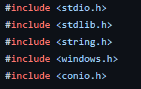

# EMPLOYEE-MANAGEMENT-SYSTEM
-----
In this project, I have made a basic employee management system which can help us to add, display, modify and delete the employees details. It can be used by small firms for managing their employees‟ data.

- **Objectives achieved from the project:-**  
  - Add record- Add details such as name, age, employee id and salary.
  - Display record- Displays the details of the employee.  
  - Modify record- On the basis of name; we can modify the details of the employee.  
  - Delete record- On the basis of name; we can delete the employee‟s data.  
  - Exit- After the completion of task, we can exit from the terminal.

- **Included Header Files:-**

- **#include <stdio.h>** - This header file has the necessary information to include the input/output related functions in our program. Example printf, scanf etc.  
- **#include <stdlib.h>** - This header file is for Standard Library. ” contains declarations of malloc() and free(). “” contains header information for „Memory Allocation/Freeing‟ functions. Functions such as exit() & system() are used from the above header file.  
- **#include <string.h>**- is the header in the C standard library for the C programming language which contains macro definitions, constants and declarations of functions and types used not only for string handling but also various memory handling functions; the name is thus something of a misnomer. Function such as strcmp() is used from the above header file.  
- **#include <windows.h>** - is a Windows-specific header file for the C and C++ programming languages which contains declarations for all of the functions in the Windows API, all the common macros used by Windows programmers, and all the data types used by the various functions and subsystems. Function such as SetConsoleCursorPosition(GetStdHandle(STD\_OUTPUT\_HAND LE) is used from the above header file.  
- **#include <conio.h>**- is a C header file used mostly by MSDOS compilers to provide console input/output. It is not part of the C standard library or ISO C, nor is it defined by POSIX. This header declares several useful library functions for performing "istream input and output" from a program. Functions such as gotoxy() & getche() are used from the above header file.

- **Output of various Menus created in the code:-**

- **Add record**

- **Delete record**

- **Display record**

- **Modify record**

